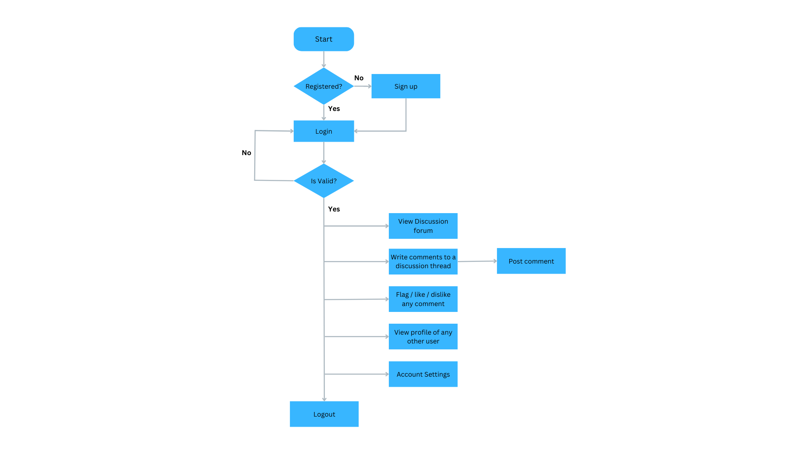
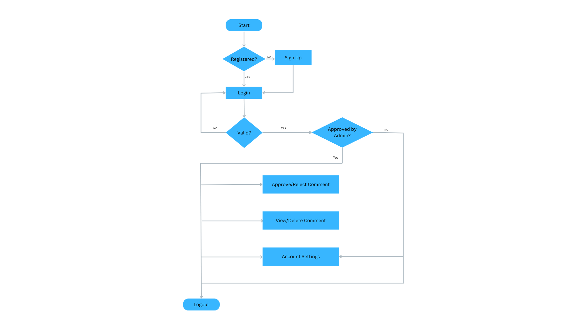
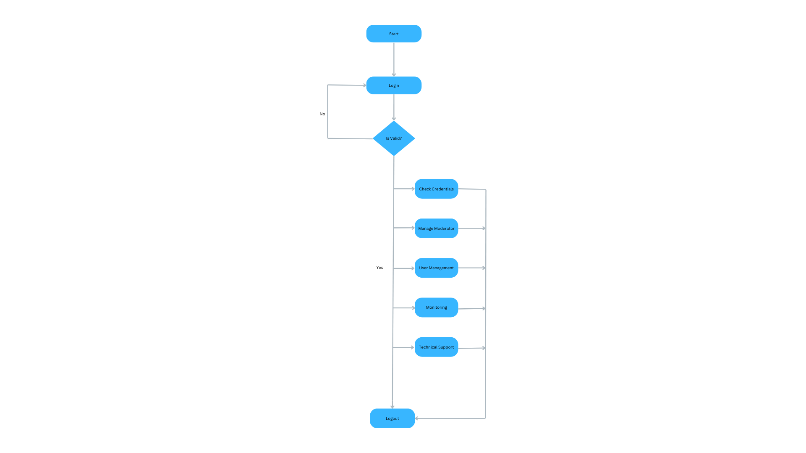

# Data Foundation System, Spring 2023

Project Number : 47

Team Name : Pops&Pills

Project Category : Blog and Discussion Forum

Project Name: Discussion Forum Integration

TA Assigned : Amit Pandey and Shaantanu Kulkarni

Team Members :

1. Laksh Balani (2020102019)
2. Knv Karthikeya (2020102003)
3. Ishanya Sethi (2020102014)

## Overview

The Discussion Forum Integration project is a software system that integrates an open source discussion forum (such as NodeBB, Discourse, or Talkyard) into an existing web application (Data Foundation). The system will provide users with a platform to discuss data sets, models, and blog posts related to the Data Foundation. The system will also support moderators and include a toxic comment classification and profanity filter. The preferred technology stack for the project is ReactJS and NodeJS.

## Project Goals

**User registration and authentication**: Allow users to create accounts and authenticate their identities, using password-based or third-party authentication methods such as OAuth or Google Sign-In.

**User profiles**: Allow users to create and manage their own profiles, including profile pictures, contact information, and other relevant details.

**Forum categories and threads**: Allow users to create and manage threads within different categories or topics, and allow other users to reply to those threads.

**Moderation tools**: Allow moderators or administrators to manage the forum content, including the ability to edit or delete threads, posts, or user accounts.

**Rich text editor**: Provide a rich text editor that allows users to format their posts with different fonts, colors, and styles, and add images or other media.

**Search functionality**: Provide a search feature that allows users to search for specific keywords, users, or topics within the forum.

## Functional Requirements

#### 1. User Management:

The system shall allow users to sign up and login with their email and password or via social login.

#### 2. Posts and Replies:

The system shall allow users to create new posts and reply to existing posts.

#### 3. Categories and Tags:

The system shall allow users to create new categories and tags for posts.

#### 4. Moderation:

The system shall allow administrators and moderators to manage and moderate posts and users.

#### 5. Search:

The system shall allow users to search for posts and replies using keywords, tags, and categories.

#### 6. Toxic Comment Classification:

The system shall classify comments as toxic or non-toxic using a machine learning model. The system shall also allow moderators to manually classify comments as toxic or non-toxic. The system shall allow users to filter toxic comments.

## Non-Functional Requirements

#### 1. Performance:

The system shall be able to handle a high volume of traffic and database queries with minimal response time.

#### 2. Scalability:

The system architecture shall be designed to scale horizontally or vertically to meet increasing traffic and database load.

#### 3. Security:

The system shall implement standard security measures to prevent unauthorized access, such as SSL/TLS encryption, user authentication, and access control.

#### 4. Usability:

The user interface shall be user-friendly, intuitive, and responsive to provide a good user experience.

#### 5. Availability:

The system shall be available 24/7 with minimal downtime for maintenance and upgrades.

#### 6. Compatibility:

The system shall be compatible with different web browsers, devices, and screen sizes.

## User Schema Details

<center>

| Field         | Type         | Decription                                                       |
| ------------- | ------------ | ---------------------------------------------------------------- |
| first_nme     | VARCHAR(255) | The first name of the user                                       |
| last_name     | VARCHAR(255) | The last name of the user                                        |
| user_password | VARCHAR(255) | The password which identifies the user                           |
| user_email    | VARCHAR(255) | Then email id of the user which is used to authenticate the user |
| institution   | VARCHAR(255) | Institution name to which the user is affiliated                 |
| designation   | VARCHAR(255) | ex: developer, professor, researcher                             |
| user_role     | VARCHAR(255) | ex: user, admin, moderator                                       |

</center>

Most of the fields are self explainatory. The field `user_role` is essential for handling permissions. Certain routes can only be handled by the super admins and need to be restricted. In such cases, the `user_role` field comes in to play.

```
CREATE TABLE `users`(
    `first_nme` VARCHAR(255) NULL,
    `last_nme` VARCHAR(255) NULL,
    `user_password` VARCHAR(255) NOT NULL,
    `user_email` VARCHAR(255) NOT NULL,
    `institution` VARCHAR(255) NOT NULL,
    `designation` VARCHAR(255) NOT NULL,
    `user_role` VARCHAR(255) NOT NULL,
);

ALTER TABLE
    `users` ADD PRIMARY KEY `users_email_primary`(`user_email`);
```

## Comments Schema Details

<center>

| Field        | Type         | Decription                                                                                                                     |
| ------------ | ------------ | ------------------------------------------------------------------------------------------------------------------------------ |
| comment_id   | BIGINT       | The id of the comment                                                                                                          |
| comment_body | VARCHAR(255) | The body of the comment                                                                                                        |
| author_email | VARCHAR(255) | The email id of the author of the comment                                                                                      |
| slug         | VARCHAR(255) | The slug of the post to which the comment belongs                                                                              |
| parent_id    | VARCHAR(255) | The id of the parent comment. If the comment is a top level comment, the value of this field is blog id                        |
| published    | TINYINT(1)   | The status of the comment. If the comment is published, the value is true. If the comment is not published, the value is false |
| created_at   | DATETIME     | The time at which the comment was created                                                                                      |
| published_at | DATETIME     | The time at which the comment was published                                                                                    |
| updated_at   | DATETIME     | The time at which the comment was updated                                                                                      |

</center>

```
CREATE TABLE `comments`(
    `comment_id` BIGINT NOT NULL,
    `comment_body` VARCHAR(255) NOT NULL,
    `author_email` VARCHAR(255) NOT NULL,
    `slug` VARCHAR(255) NOT NULL,
    `parent_id` VARCHAR(255) NULL,
    `published` TINYINT(1) NOT NULL DEFAULT '0',
    `created_at` DATETIME NOT NULL,
    `published_at` DATETIME NULL,
    `updated_at` DATETIME NULL,
);
ALTER TABLE
    `comments` ADD PRIMARY KEY `comments_id_primary`(`comment_id`);
```

## Comment Request Table

In this section, we will design the Comment Request Table to store the comment request data. Below mentioned is the description of all the columns of the Comment Request Table.
| Field | Type | Description |
| --- | --- | --- |
| id | BIGINT | It acts as a primary key here and stores comment request number |
| user_email | VARCHAR(255) | The email id of the author |
| comment_id | BIGINT | This reference to the ID of comments table |
| approved | TINYINT(1) | It can be used for idetnifying whether the comment request is approved or not |
| approved_by | VARCHAR(255) | It indicates that comment is approved by whom |
| requested_at | DATETIME | When the comment is requested for approval |
| approved_at | DATETIME | When the comment is approved by moderator or admin |

```
CREATE TABLE `comment_request`(
    `id` BIGINT NOT NULL,
    `user_email` VARCHAR(255) NOT NULL,
    `comment_id` BIGINT NOT NULL,
    `approved` TINYINT(1) NOT NULL DEFAULT '0',
    `approved_by` VARCHAR(255) NOT NULL,
    `requested_at` DATETIME NOT NULL,
    `approved_at` DATETIME NULL
);
ALTER TABLE
    `comment_request` ADD PRIMARY KEY `comment_request_id_primary`(`id`);
```

## Moderator Request Table

In this section, we will design the Moderator Request Table to store the Moderator request data. Below mentioned is the description of all the columns of the Moderator Request Table.
| Field | Type | Description |
| --- | --- | --- |
| id | BIGINT | It acts as a primary key here and stores moderator request number |
| user_email | VARCHAR(255) | This reference to the email ID of USERS table. |
| approved | TINYINT(1) | It can be used for identifying whether the moderator request is approved or not |
| approved_by | VARCHAR(255) | It indicates that moderator request is approved by whom. obviously admin |
| requested_at | DATETIME | When the user is requested for approval to become the moderator |
| approved_at | DATETIME | When the user request is approved as moderator |

```
CREATE TABLE `moderator_request`(
    `id` BIGINT NOT NULL,
    `user_email` VARCHAR(255) NOT NULL,
    `approved` TINYINT(1) NOT NULL DEFAULT '0',
    `approved_by` VARCHAR(255) NOT NULL,
    `requested_at` DATETIME NOT NULL,
    `approved_at` DATETIME NULL
);
ALTER TABLE
    `moderator_request` ADD PRIMARY KEY `moderator_request_id_primary`(`id`);
```

## Flow Chart

#### User Work Flow



#### Moderator Work Flow



#### Admin Work Flow


